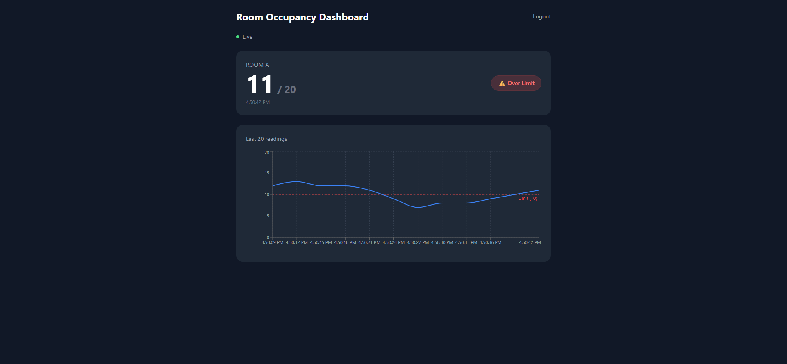

# Real-time Room Occupancy Dashboard

> Mini Smart Building dashboard ที่ simulate sensor data และแสดง occupancy แบบ real-time ผ่าน WebSocket พร้อม LINE alert เมื่อคนเกิน threshold



## Live Demo

| | URL |
|-|-----|
| Frontend | https://your-app.vercel.app *(update after deploy)* |
| API | https://your-app.railway.app *(update after deploy)* |
| Credentials | `admin` / `admin123` |

---

## Features

- **Real-time occupancy chart** — WebSocket push every 3 s, no polling
- **JWT authentication** — login-gated dashboard, token expires in 1 h
- **Threshold alerts** — LINE Messaging API notification with 5-min cooldown
- **Sensor simulator** — random occupancy 0–20 people, no hardware needed
- **Status badge** — green (normal) / red (over limit) at a glance

---

## Tech Stack

| Layer | Tech |
|-------|------|
| Backend | Node.js, Express, ws (WebSocket) |
| Auth | JWT (jsonwebtoken) |
| Frontend | React 18, Vite, Tailwind CSS, Recharts |
| Notification | LINE Messaging API |
| Dev tooling | nodemon, dotenv, concurrently |

---

## Architecture

```
Browser (React + Vite)
    │   POST /api/login  ──────────────────────┐
    │   GET  /api/status (JWT header)           │
    │   WS   ws://localhost:3001 (JWT query)    │
    └───────────────────────────────────────────┤
                                          Express + ws
                                                │
                              ┌─────────────────┤
                         simulator.js      auth.js
                         (random count     (JWT verify
                          every 3 s)        middleware)
                              │
                         count > threshold?
                              │ yes
                         lineNotify.js ──► LINE API
```

---

## Project Structure

```
room-occupancy-dashboard/
├── server/
│   ├── index.js          # Express + WebSocket server
│   ├── auth.js           # JWT middleware
│   ├── simulator.js      # Fake sensor data
│   ├── lineNotify.js     # LINE alert (5-min cooldown)
│   └── .env              # secrets — never committed
├── client/
│   ├── src/
│   │   ├── App.jsx
│   │   ├── pages/
│   │   │   ├── Login.jsx
│   │   │   └── Dashboard.jsx
│   │   └── components/
│   │       ├── OccupancyChart.jsx
│   │       └── StatusBadge.jsx
│   └── vite.config.js
├── .gitignore
└── README.md
```

---

## Setup

### 1. Clone & install

```bash
git clone https://github.com/<your-username>/room-occupancy-dashboard.git
cd room-occupancy-dashboard

cd server && npm install && cd ..
cd client && npm install && cd ..
```

### 2. Configure environment

```bash
cp server/.env.example server/.env
```

Edit `server/.env`:

```env
PORT=3001
JWT_SECRET=change_this_to_a_random_string
LINE_CHANNEL_ACCESS_TOKEN=your_line_channel_access_token
LINE_USER_ID=your_line_user_id
OCCUPANCY_THRESHOLD=10
```

> **LINE setup** — create a channel at [LINE Developers](https://developers.line.biz/), enable Messaging API, issue a channel access token, and get your user ID via the bot.

### 3. Run (dev)

```bash
# from project root
npm run dev          # starts server + client concurrently
```

- Server: `http://localhost:3001`
- Client: `http://localhost:5173`

---

## API Reference

| Method | Path | Auth | Description |
|--------|------|------|-------------|
| `POST` | `/api/login` | — | Returns JWT token |
| `GET` | `/api/status` | Bearer JWT | Current occupancy snapshot |
| `WS` | `ws://localhost:3001` | token in query | Real-time occupancy stream |

### WebSocket message (server → client)

```json
{
  "type": "occupancy_update",
  "room": "Room A",
  "count": 7,
  "timestamp": "2025-06-22T10:30:00Z",
  "alert": false
}
```

`alert: true` when `count > OCCUPANCY_THRESHOLD`.

---

## Demo Credentials

| Field | Value |
|-------|-------|
| Username | `admin` |
| Password | `admin123` |

> Demo only — change before any real deployment.

---

## Environment Variables

| Variable | Required | Description |
|----------|----------|-------------|
| `PORT` | yes | Express server port (default 3001) |
| `JWT_SECRET` | yes | Secret for signing tokens |
| `LINE_CHANNEL_ACCESS_TOKEN` | yes | LINE bot token |
| `LINE_USER_ID` | yes | LINE user to notify |
| `OCCUPANCY_THRESHOLD` | yes | Person count that triggers alert |

---

## Roadmap

- [ ] Multi-room support
- [ ] Historical data storage (SQLite / PostgreSQL)
- [ ] Deploy: Railway (server) + Vercel (client)
- [ ] Docker Compose for one-command setup

---

## License

MIT
